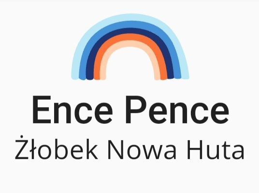

<!-- PROJECT LOGO -->
<br />
<p align="center">
  <a href="https://github.com/M-Kolacz/EncePenceHuta">
    
  </a>

  <h3 align="center">Ence Pence Żłobek Nowa Huta</h3>

  <p align="center">
    Nursery website
    <br />
    <a href="https://github.com/M-Kolacz/EncePenceHuta"><strong>Explore the docs »</strong></a>
    <br />
    <br />
    <a href="http://zlobeknowahuta.pl/">Live view</a>
    ·
    <a href="https://github.com/M-Kolacz/EncePenceHuta/issues">Report Bug</a>
    ·
    <a href="https://github.com/M-Kolacz/EncePenceHuta/issues">Request Feature</a>
  </p>
</p>


<!-- TABLE OF CONTENTS -->
<details open="open">
  <summary><h2 style="display: inline-block">Table of Contents</h2></summary>
  <ol>
    <li>
      <a href="#about-the-project">About The Project</a>
      <ul>
        <li><a href="#built-with">Built With</a></li>
      </ul>
    </li>
    <li>
      <a href="#getting-started">Getting Started</a>
      <ul>
        <li><a href="#prerequisites">Prerequisites</a></li>
        <li><a href="#installation">Installation</a></li>
      </ul>
    </li>
    <li><a href="#contact">Contact</a></li>
  </ol>
</details>


<!-- ABOUT THE PROJECT -->
## About The Project

[![Product Name Screen Shot][website-screenshot]](http://zlobeknowahuta.pl/)

The project was created for a client who needed a website for his nursery. Communication took place at every stage of creating the website to adapt to the changing requirements of the client. The text content of the website was developed in cooperation with the client.

The most important needs for the client were:
<ul>
<li>Contact form for the interested parent</li>
<li>Implementation of the goggle map with the presentation of the nursery location</li>
<li>Presentation of the nursery</li>
<li>Social media links</li>
</ul>


### Built With

* [React](https://reactjs.org/)
* [Next.js](https://nextjs.org/)
* [Material-UI](https://material-ui.com/)
* [Formik](https://formik.org/)


<!-- GETTING STARTED -->
## Getting Started

To get a local copy up and running follow these simple steps.

### Prerequisites

This is an example of how to list things you need to use the software and how to install them.
* npm
  ```sh
  npm install npm@latest -g
  ```

### Installation

1. Clone the repo
   ```sh
   git clone https://github.com/M-Kolacz/EncePenceHuta.git
   ```
2. Install NPM packages
   ```sh
   npm install
   ```

<!-- CONTACT -->
## Contact

* Email - michal.kolacz45@gmail.com
* Linkedin - https://www.linkedin.com/in/m-kolacz/
* Twitter - [@M_Kolacz](https://twitter.com/M_Kolacz)


[website-screenshot]: readme/screenshot.png
